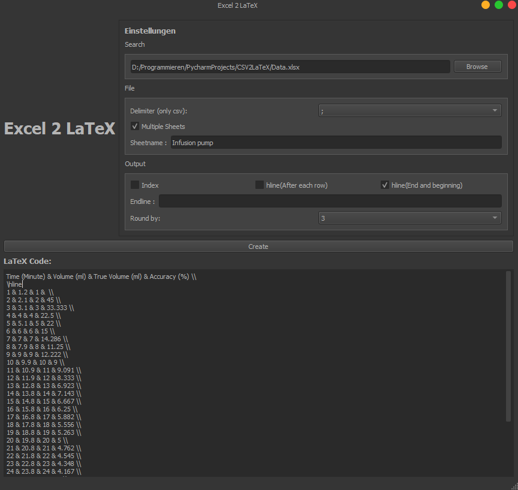

# Excel 2 LaTeX

Excel 2 LaTeX is a simple converter that creates a LaTex table code out of a excel or csv file. It comes with some options
to adjust the output. For csv files, it is possible to choose the `delimiter` to get a proper result. In case a Excelfile
has `multiple sheets`, the `sheet name` can be used to get the wanted table.  The `endline` option can be used to add something at the end of each row, for example `\addlinespace`.
In addition, there is an option to decide if the `index` should be included or not. This is aiming to the row index.
Furthermore, it is possible to add lines to the table with the LaTeX `hline` command. There are to options, adding lines after each row, or adding lines just at the column lines and the 
top and bottom of the table. If necessary, floats can be `rounded` with the specified number of decimals. Integers will not be
affected by this, numbers with %1 = 0 will be given back as integer.


## Used Tools

The GUI of the app is created with th QT Creator and converted with the qtpy tool. The QT originally uses C++, which is why
most of the method names are in Camel Case Notation, against the normal convention of Python.
The GUI can be change with the QT creator to add new features.

## Installation

```bash
pip install .
```
or

```bash
pip install -r requirements.txt
```

## Usage

```python
python main.py
```
## Contributing
Pull requests are welcome. For major changes, please open an issue first to discuss what you would like to change.

Please make sure to update tests as appropriate.

## License
[GPL](https://www.gnu.org/licenses/why-not-lgpl.html)
